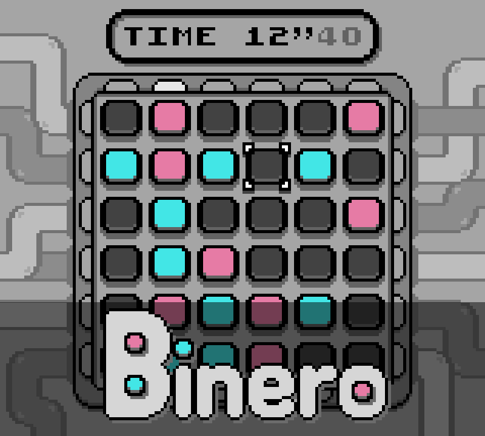

# Binero (GBC)



My first GBDK 2020 project made in a few weeks, a complete puzzle game with visuals, audio and >60 000 random generating boards. I got the help of some friends for beta-testing and ideas. (Working title was Takuzu)

Original concept is "Binairo" by Frank Coussement & Peter De Schepper.

Please note that the code is not very clean, mainly because of the use of global variables as it takes less memory in the cartridge.

[Have fun playing !](https://electrictiti.itch.io/binero)

## _-TiTi_


# Game rules & Controls

**Controls :**

- Arrow keys : Move on the board
- A : Change tile's color (blue, pink or gray) (red cursor means the tile is from the beginning statement and can't be changed)
- B : Undo last change (only keeps last 20 moves, red cursor means there's no more history)
- Start/Select : Pause menu

**The game has three simple rules :**

- There can't be three tiles of the same color aligned in lines or columns (Flag will be red if there's an error)
- Each line and column has three tiles of each color (Flag will be red if there's an error)
- Two lines can't have the same pattern, same for columns (Flags will be gray if there's a duplicate line or column)

**Play with your friends!**

The game has a password menu to select which board should be generated. Thus you can compete with anyone using the same code and find who's the fastest to finish it!

**Designed to be fun to play!**

When holding a direction button, the cursor will be pushed to the border. This mechanic is called the DAS (Delayed Auto Shift) and the options menu offers a way to modify its speed. May help going faster from a side to another!

# How to compile

GBDK 2020 is used to compile the project.

First step is making every `.o` files in the same folder by doing this command for each file :
```
lcc_path -Wa-l -Wl-m -Wl-j -c -o bin/[file].o [file_path].c
```

Second step is linking files to create ROM file (`.gb` format) with this command :
```
lcc_path -Wm-yn"BINERO" -Wa-l -Wl-m -Wl-j -Wm-yC -o export/binero.gb bin/*.o
```

# Changelog

## v1.1

- Added screen if not run as GameBoy Color
- Added rules & controls screens in menu

## v1.0

- Game is out!